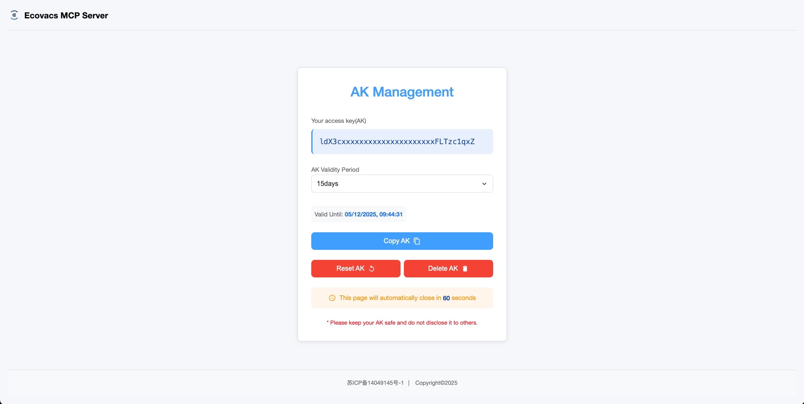
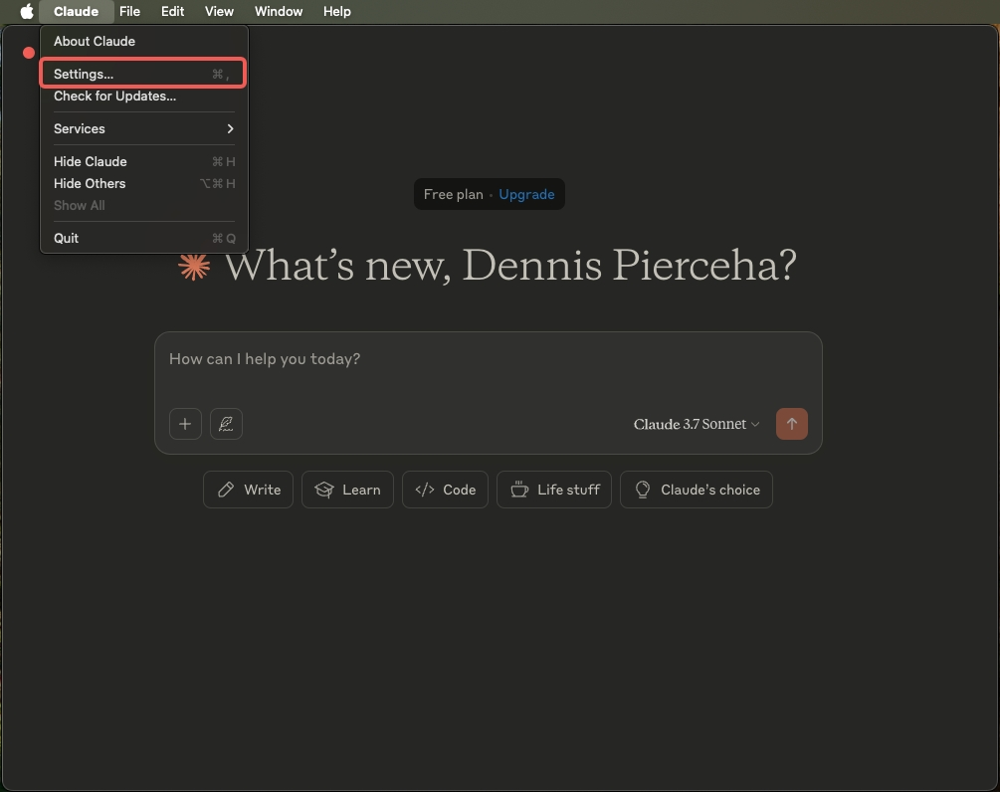
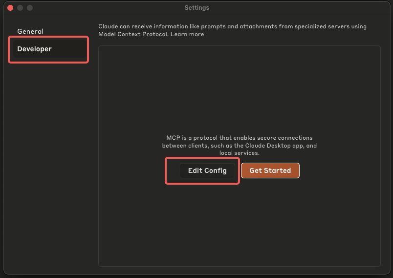
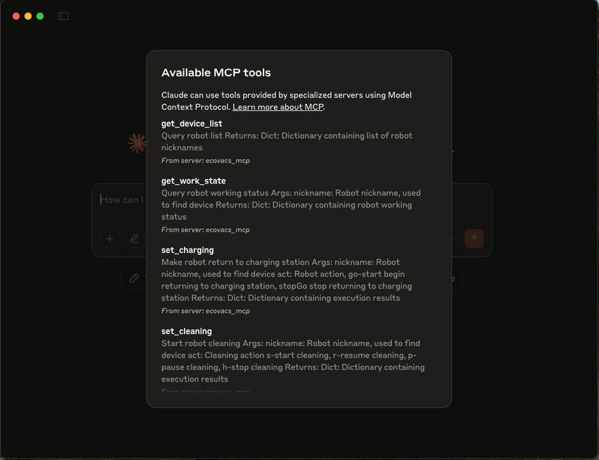
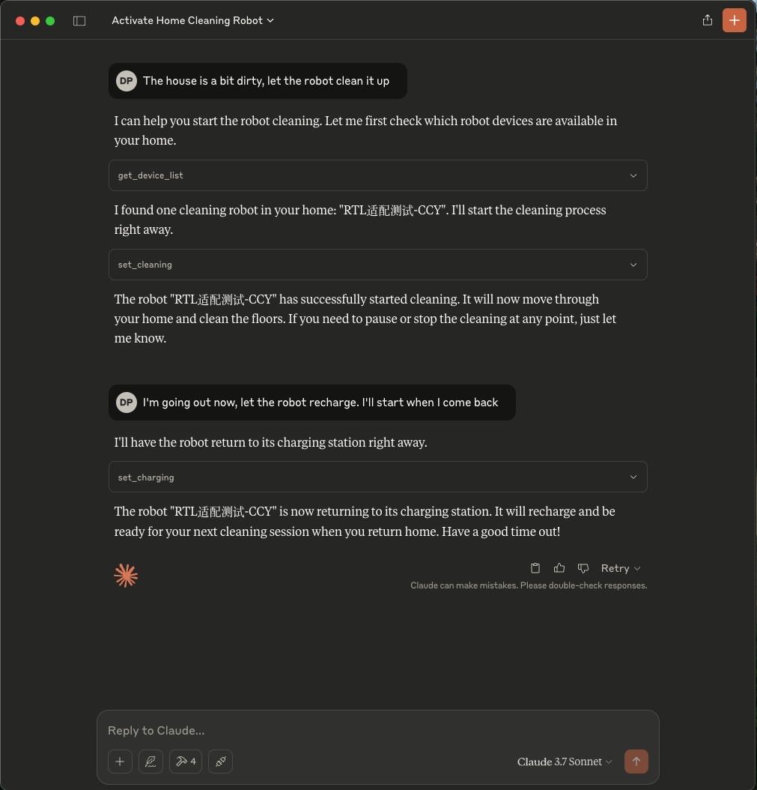
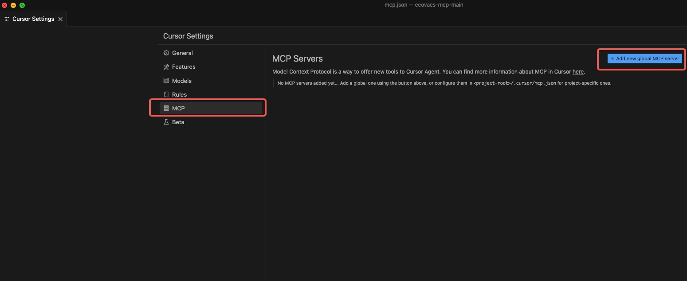
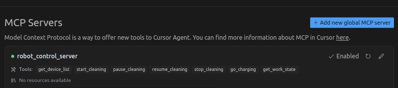
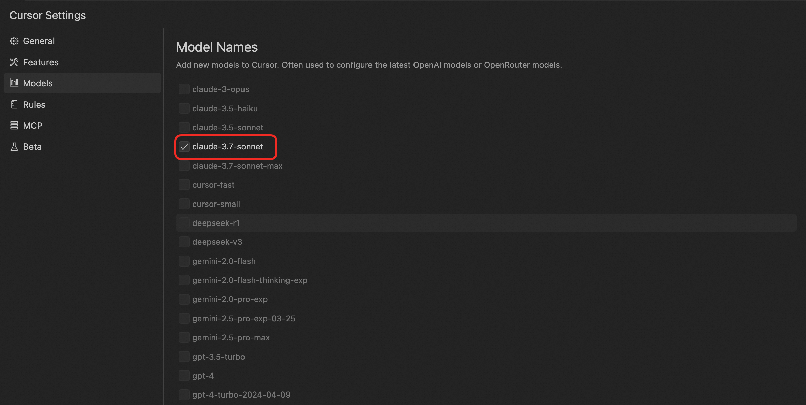
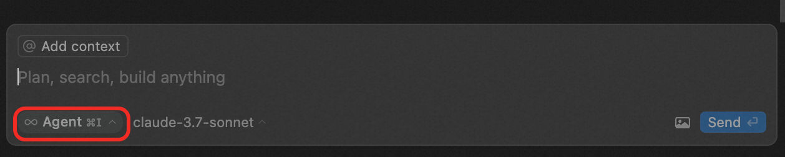
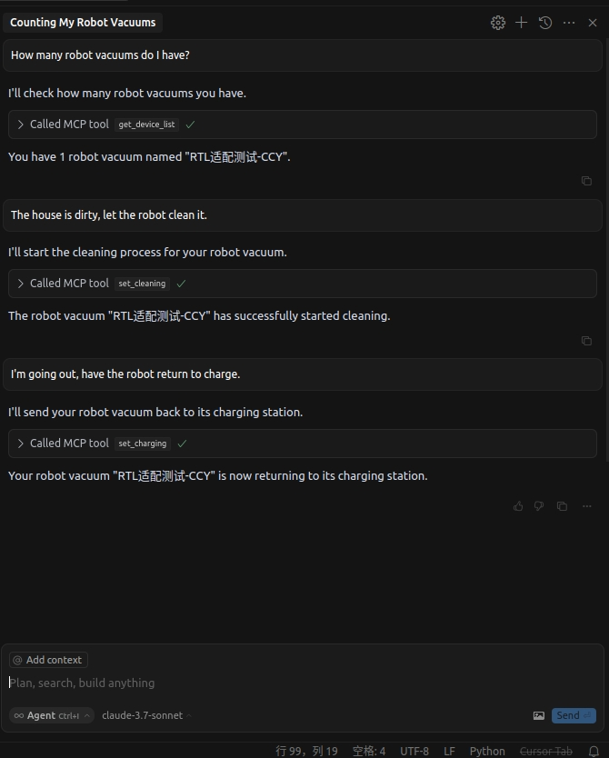

# Robot Vacuum Control MCP Server

English | [中文](README.md)

Ecovacs core API now fully supports the MCP protocol, making it the world's first robot service provider compatible with the MCP protocol.

Ecovacs has completed the integration of 4 core API interfaces with the MCP protocol, including device list query, cleaning control, recharging control, and working status query.

As the world's first cleaning robot service provider to support the MCP protocol, after the release of Ecovacs MCP Server, AI agent developers only need simple configuration to quickly access robot services in large language models, enabling query, cleaning, recharging, and other capabilities.

This significantly lowers the threshold for calling robot control services during AI agent application development and greatly improves the development efficiency of AI agent applications.

## Tools

### Device List Query

Get a list of all robots bound to the user.

#### Input:

No parameters

#### Returns:

```json
{
  "status": 0,
  "message": "success",
  "data": [
    {
      "nickname": "Robot nickname",
    }
  ]
}
```

### Start Cleaning

Control the robot vacuum to start, pause, resume, or stop cleaning.

#### Input:

- `nickname`: Robot nickname, used to find the device, supports fuzzy matching
- `act`: Cleaning action
  - `s`: Start cleaning
  - `r`: Resume cleaning
  - `p`: Pause cleaning
  - `h`: Stop cleaning

#### Returns:

```json
{
  "msg": "OK",
  "code": 0,
  "data": []
}
```

### Control Recharging

Control the robot to start or stop recharging.

#### Input:

- `nickname`: Robot nickname, used to find the device
- `act`: Robot action
  - `go-start`: Start recharging
  - `stopGo`: Stop recharging

#### Returns:

```json
{
  "msg": "OK",
  "code": 0,
  "data": []
}
```
### Query Working Status

Query the robot's current working status.

#### Input:

- `nickname`: Robot nickname, used to find the device

#### Returns:

```json
{
	"code": 0,
	"msg": "success",
	"data": {
		"ctl": {
			"data": {
				"ret": "ok",
				"cleanSt": "h",
				"chargeSt": "charging",
				"stationSt": "i"
			}
		}
	}
}
```

**Status Code Description:**

| Parameter  | Type           | Description                                                                                                                                                                                                                                                               |
| ---------- | -------------- | ------------------------------------------------------------------------------------------------------------------------------------------------------------------------------------------------------------------------------------------------------------------------- |
| cleanSt    | string         | Cleaning status, exists when request is successful. s-cleaning, p-paused, h-idle, goposition-going to specified position, gopositionpause-stopped at specified point, findpet-finding pet, findpetpause-pet finding paused, cruise-cruising, cruisepause-cruise paused, buildmap-creating map, buildmappause-map building paused |
| chargeSt   | string         | Charging status, exists when request is successful. g-returning to charge, gp-return to charge paused, i-idle, sc-dock charging, wc-wire charging, charging-charging (includes SC and WC)  
| stationSt  | string         | Station status, i-idle, wash-washing mop, dry-drying, drypause-drying paused, dust-dust collecting, dustpause-dust collection paused, clean-station cleaning, cleanpause-station cleaning paused, wash-washing mop, washpause-mop washing paused  


## Getting Started

## Installation

### GitHub Local Installation

```bash
git clone git@github.com:ecovacs-ai/ecovacs-mcp.git

uv add "mcp[cli]" mcp requests

uv run ecovacs_mcp/robot_mcp_stdio.py
```


### pipy

```
pip install ecovacs-robot-mcp

python3 -m ecovacs_robot_mcp

```

## Environment Variables

- `ECO_API_KEY`: API access key, used to authenticate API call permissions
- `ECO_API_URL`: API HOST
  - Mainland China:`https://open.ecovacs.cn`
  - Outside Mainland China: `https://open.ecovacs.com`
## Get AK & Delete AK

Before choosing between the two methods (local or SSE), you need to create a server AK in the [Ecovacs Open Platform Console](https://open.ecovacs.com) to call the robot's API capabilities through the AK.

If you want to cancel the authorization, you can also remove the AK authorization in the [Ecovacs Open Platform Console](https://open.ecovacs.com).

Ecovacs Open Platform (Mainland China): https://open.ecovacs.cn

Ecovacs Open Platform (Outside Mainland China): https://open.ecovacs.com



## Usage Example (Claude Example)

Open Claude for Desktop's Setting, switch to Developer, click Edit Config, and open the configuration file with any IDE.





Add the following configuration to the configuration file. ECO_API_KEY is the AK for accessing the Ecovacs Open Platform API, which can be obtained from [this page](https://open.ecovacs.cn/preparationForUse):

```json
{
    "mcpServers": {
        "ecovacs_mcp": {
            "command": "/Users/home/.local/bin/uv",
            "args": [
                "--directory",
                "/Users/home/ecovacs-mcp-main/ecovacs_mcp",
                "run",
                "robot_mcp_stdio.py"
            ],
            "env": {
                "ECO_API_KEY": "your AK...........",
                "ECO_API_URL": "https://open.ecovacs.cn" 
              // For regions outside Mainland China, configure as https://open.ecovacs.com
            }
        }
    }
}
```

Restart Claude, and the settings panel will successfully load the Ecovacs Robot MCP Server. In the main interface dialog, you can see 4 available MCP tools. Click to view details.



#### Effect

Now you can ask questions and verify the capabilities of the Ecovacs robot assistant.



## Usage Example (Cursor Example)
### Enter Cursor Settings Interface to Configure SSE Connection



### Add a New MCP Server Configuration

```json
{
  "mcpServers": {
    "robot_control_server": {
      "url": "https://open.ecovacs.cn/sse?ak=your ak"
      // For regions outside Mainland China, configure as https://open.ecovacs.com/sse?ak=your ak
    }
  }
}
```

### Return to Cursor Settings Interface to Check MCP Service Tool Status



### Choose to Configure Cursor Large Model for a Better Service Experience, Claude-3.7-sonnet is Recommended



### Model Interaction Mode: Choose Agent Method



### Effect



## License

[MIT](LICENSE)  © ecovacs

## Feedback

For any issues encountered while using the Ecovacs Robot MCP Server, please feel free to contact us through `issue` or direct contact. We also welcome every positive `PR`. Thank you very much for your support and contribution ❤️

## Contact Information

Mail: pei.zhou@ecovacs.com

WeChat:


## Updates

| Version | Feature Description            | Update Date    |      |      |      |
| ------- | ------------------------------ | -------------- | ---- | ---- | ---- |
| V1.0    | Ecovacs MCP Server Officially Launched | April 24, 2025 |      |      |      |

